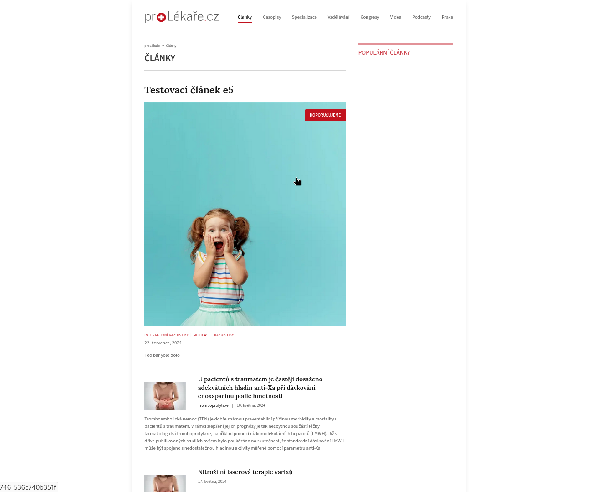
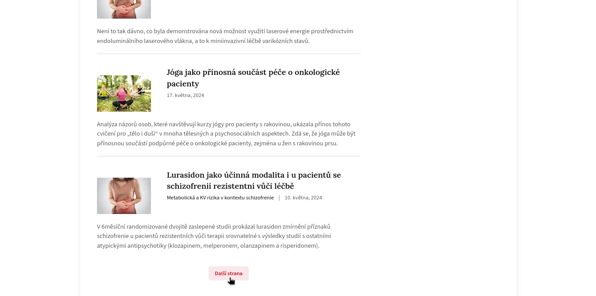

## proLékaře.cz

Welcome to the simple app to fetch and display articles for doctors and other professionals seamlessly!ň

The app uses newest TypeScript with Tailwind CSS and is quite good adapted also for your mobile phone screen.

GraphQL was used fo data fetching.

The articles are sorted by `date updated` (descending order), as `public_from` a `public_till` attributes can be `null`. Also only those with shortcut "PL" are listed.

You can click on "Další stránka" if there are more articles (contents) to see.

This is a [Next.js](https://nextjs.org) project bootstrapped with [`create-next-app`](https://nextjs.org/docs/app/api-reference/cli/create-next-app).

## Visuals





## Getting Started

```bash
npm install
```

First, run the development server:

```bash
npm run dev
```

Open [http://localhost:3000](http://localhost:3000) with your browser to see the result.

This project uses [`next/font`](https://nextjs.org/docs/app/building-your-application/optimizing/fonts) to automatically optimize and load [Geist](https://vercel.com/font), a new font family for Vercel.

## Further improvements/coming soon:

This project is very fresh, hence lots of improvements can be done, for example:

- parse fetched html safely to be nicely displayed
- improve responsiveness, use hamburger button for mobile screens for navigation
- improve the existing accessibility
- add unit/integration testing
- improve the components code structure
- fix warnings in browser console
- improve dark mode support
  and more!

## Deploy on Vercel

The easiest way to deploy your Next.js app is to use the [Vercel Platform](https://vercel.com/new?utm_medium=default-template&filter=next.js&utm_source=create-next-app&utm_campaign=create-next-app-readme) from the creators of Next.js.

Check out our [Next.js deployment documentation](https://nextjs.org/docs/app/building-your-application/deploying) for more details.
